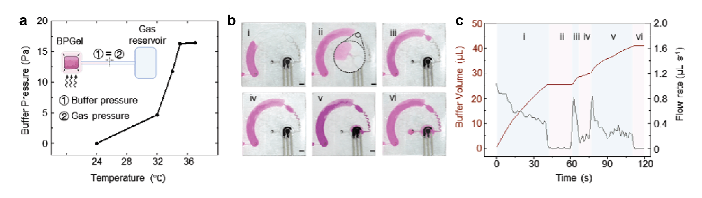

# BPGel_microfluidics
## Description
This repository contains the microfluidic tracking and analysis pipeline used to quantify hydrogel(BPGel)-actuated fluid transport in a wearable microfluidic–electrochemical biosensing system. The project supports the manuscript *"Hydrogel-actuated microfluidic wearable system for in situ detection of solid-state epidermal macromolecules"*. The tracking framework enables time-resolved visualization and quantification of buffer propagation, transported volume, and flow rate within a skin-conformal microfluidic channel driven by a temperature-responsive hydrogel pump. [](https://doi.org/10.5281/zenodo.18241033)


Upon being placed on the surface of the skin, the change in temperature drive conformational change in the BPGel that prompt buffer releasing (**Figure a**). The released buffer progress through a curved microchannel in the microfluidic chamber (**Figure b**). Using the code provided in this repository, the cumulative change in volume and buffer flow rate can be tracked (**Figure c**).


## Deployment
Change to directory of your project. Create virtual environment and load the dependencies according to `requirements.txt`.
```
python -m venv [name of virtual environment]
source [name of virtual environment]/bin/activate
pip install -r ./requirements.txt
```
### Volume Tracking
To track the volume changes and further deduce the flow rate, run the `Volume_Tracker.py` file. Based on the chamber dimensions (i.e. area and depth), modify line 197 and 198. Change the `video_path = "analysis_vid_DIRECTORY"` to the video file path you intend to analyze (line 201) and change `output_csv = "analyzed_csv_file_NAME"` to the csv file name you want to save the volume and flow rate info to (line 205). Depending on the operating system you have, run either:
```
python run Volume_Tracker.py
python3 run Volume_Tracker.py
```

### Visualization
The tracked volume changes and flow rates can be visualized using `Visualization.py` file. Change the `df = pd.read_csv("volume_tracking_file.csv")` to the directory of the file generated from volume tracker (line 9). Change `cap = cv2.VideoCapture("analysis_vid_DIRECTORY")` to the video that you want to overlay the analysis result on to. To execute the file, run either:
```
python run Visualization.py
python3 run Visualization.py
```